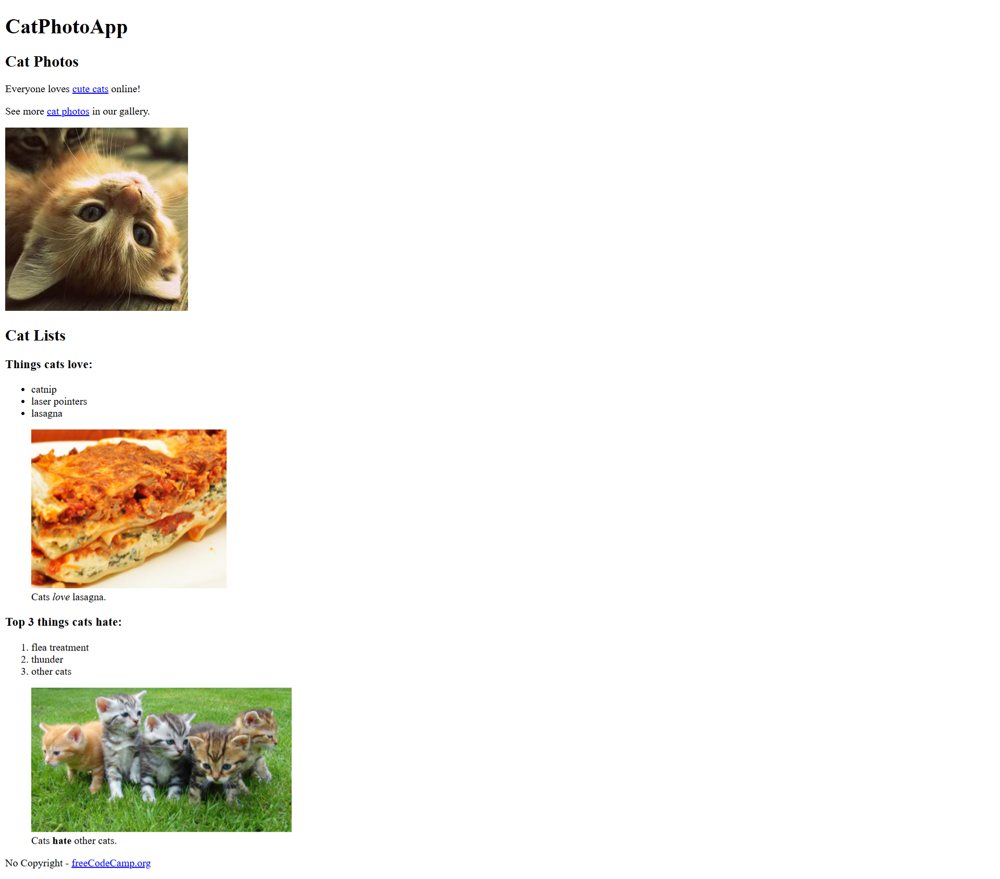

# 🐱 HTML Cat Photo App

This is a simple HTML project built as part of my **FreeCodeCamp Full Stack Development journey**.  
It showcases basic HTML structure and image handling, and it's the very first step of my front-end dev path. 💪

## 🚀 What I Learned

- Structuring an HTML page with proper tags
- Inserting and styling images
- Creating links and using attributes like `target="_blank"`
- Using semantic elements like `<main>`, `<section>`, and `<footer>`

## 🔧 Tech Stack

- HTML5 (no CSS or JS yet — keeping it clean & focused!)

## 📸 Preview

